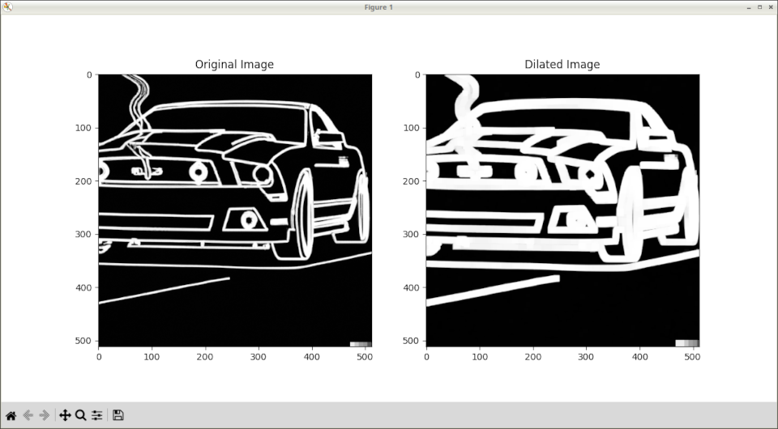

# OpenCV Dilation Demo

A demo of how to use dilation with OpenCV. 



This is code from my article, [Dilation Demystified: A Complete Guide to Image Dilation with OpenCV](https://www.jeremymorgan.com/tutorials/opencv/dilate-opencv-python/)


Also featured on the [Computer Vision Power Hour](https://www.twitch.tv/jeremymorgan/schedule?vodID=1773385086)

## Running these files

Have Python installed on your machine.

Create a new Python environment.

run:

```
pip install -r requirements.txt
```

Enjoy!
